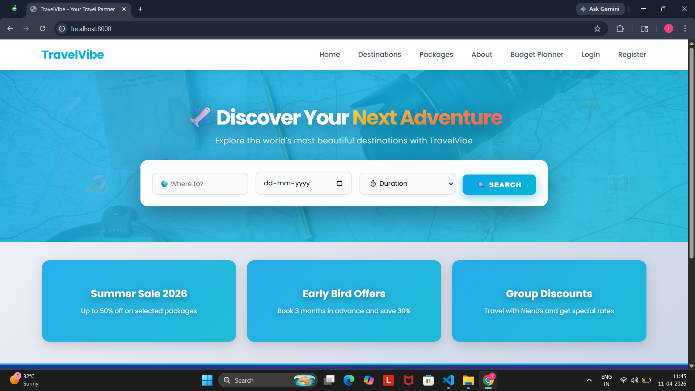
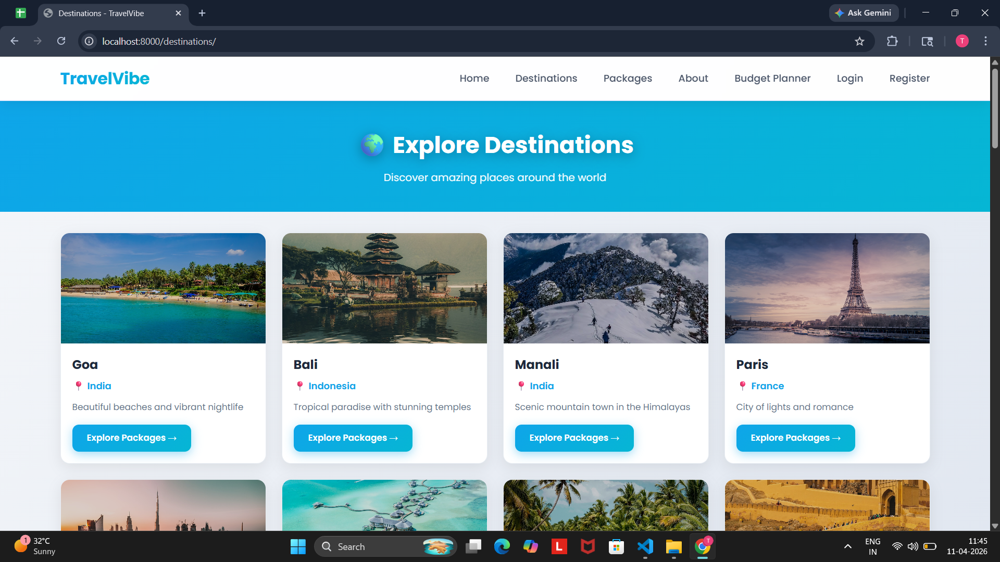
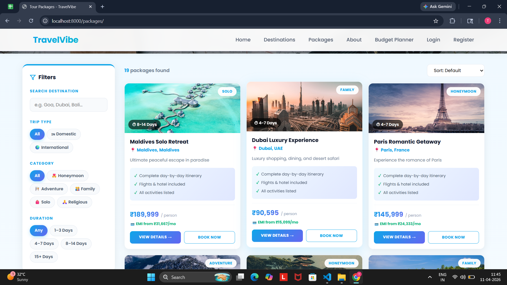
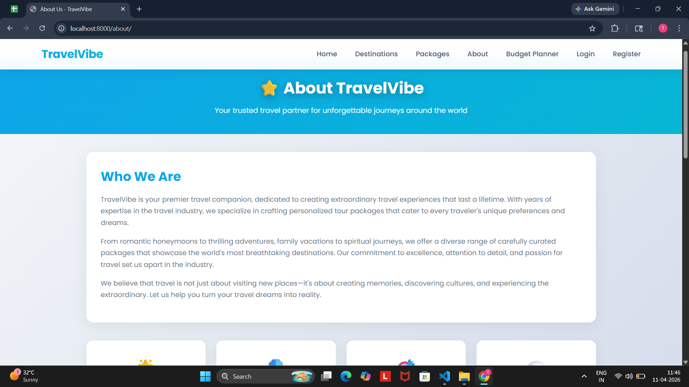
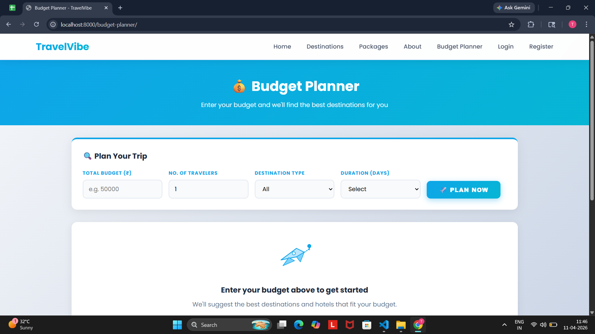
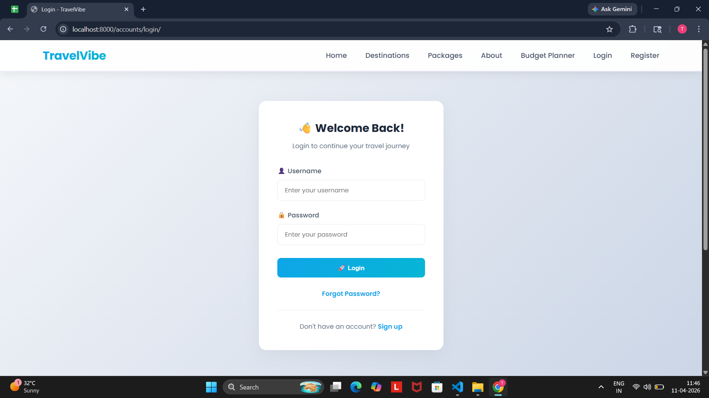
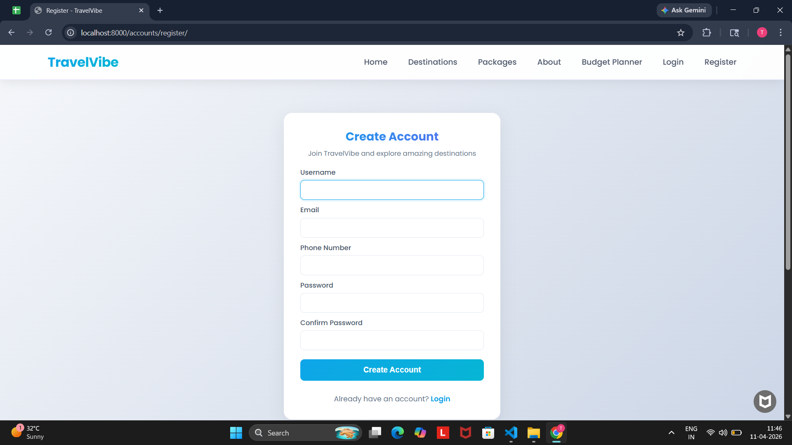
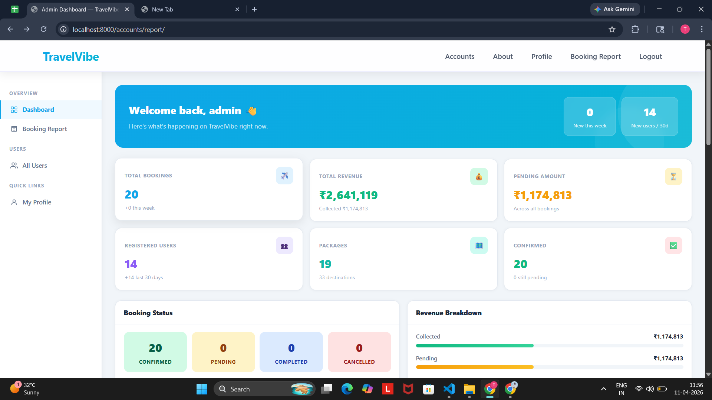

# TravelVibe E-Commerce Website

A comprehensive Django-based e-commerce platform for travel packages and tour bookings.4

---

## Project Structure

```
TravelVibe/
├── manage.py
├── requirements.txt
├── travelvibe/              # Main project settings
│   ├── settings.py          # Django settings
│   ├── urls.py              # Main URL configuration
│   └── wsgi.py              # WSGI configuration
├── accounts/                # User Management (Step 1)
│   ├── models.py            # CustomUser, OTPVerification
│   ├── views.py             # Registration, Login, Profile
│   ├── forms.py             # User forms
│   └── utils.py             # OTP utilities
├── store/                   # Homepage & Packages (Steps 2-4)
│   ├── models.py            # Destination, TourPackage, Wishlist, Banner, Testimonial
│   ├── views.py             # Homepage, Package catalog, Package detail
│   └── admin.py             # Admin interfaces
└── bookings/                # Booking System (Steps 5-7)
    ├── models.py            # Booking, Traveler, Payment, Coupon, Inquiry
    ├── views.py             # Booking process, Checkout, User dashboard
    └── admin.py             # Booking management
```

---
    ## 📸 Screenshots

    ### Home Page

    

    ### Destination Page

    

    ### Packages Page

    

    ### About Page

    

    ### BudgetPlanner Page

    

    ### Login Page

    

    ### Register Page

    

    ### Admin Dashboard

    

    ---


    ## Features Implemented

    ### Step 1: User Management ✅
    - Registration with Email & Phone Number
    - Login & Logout
    - OTP Verification for secure login
    - Forgot Password / Reset Password
    - User Profile (Edit Name, Phone, Passport Details)

    ### Step 2: Homepage (Front Store) ✅
    - Hero Section with Search Bar (Destination, Date, Duration)
    - Banners for Promotional Offers
    - Trending Destinations (Goa, Bali, Manali, etc.)
    - Featured Tour Packages
    - Customer Testimonials with Ratings
    - Footer (Contact, Social Media, Terms & Conditions)

    ### Step 3: Packages Catalog & Filters ✅
    - Categories: Honeymoon, Adventure, Family, Solo, Religious
    - Filters: Price Range, Duration, Destination
    - Sorting: Price (Low to High), Popularity
    - Wishlist Button to save packages

    ### Step 4: Package Detail Page ✅
    - Package Title & Price (Per Person)
    - Image Gallery with multiple high-quality photos
    - Day-wise Itinerary (Day 1, Day 2, etc.)
    - Inclusions/Exclusions list
    - Availability Calendar
    - "Book Now" and "Enquire" buttons

    ### Step 5: Booking Process ✅
    - Select Travel Date
    - Add Travelers (Adults & Children count)
    - Traveler Details (Name, Age, Gender for each)
    - Apply Coupon Code for discounts
    - Price Breakdown (Base Fare + Taxes = Total)

    ### Step 6: Checkout & Payment ✅
    - Review Booking Summary
    - Payment Options: UPI, Credit/Debit Card, Net Banking
    - Partial Payment option (Token amount or Full payment)
    - Order Confirmation with Booking ID
    - Email/SMS Booking Voucher

    ### Step 7: User Dashboard ✅
    - My Bookings (Upcoming & Past Trips)
    - Download PDF Voucher/Invoice
    - Cancel Booking or Request Rescheduling
    - Saved Travelers for quick booking

    ### Step 8: Admin Panel ✅
    - Dashboard: Total Revenue, Bookings, Active Users
    - Package Management: Add/Edit/Delete packages
    - Booking Management: View and update booking status
    - Inquiry Management: Handle customer queries
    - Banner Management: Update homepage banners

    ### Step 9: Database Schema ✅

    All tables implemented:

    **accounts app:**
    - `CustomUser`: ID, Username, Email, Phone, Password, Passport details
    - `OTPVerification`: OTP codes for email verification

    **store app:**
    - `Destination`: ID, Name, Country, Image, Description
    - `TourPackage`: ID, Destination_ID, Title, Category, Price, Duration, Itinerary, Images
    - `PackageImage`: Gallery images for packages
    - `Wishlist`: User saved packages
    - `Banner`: Homepage promotional banners
    - `Testimonial`: Customer reviews

    **bookings app:**
    - `Booking`: ID, User_ID, Package_ID, Travel_Date, Total_Amount, Status
    - `Traveler`: ID, Booking_ID, Name, Age, Gender
    - `Payment`: ID, Booking_ID, Transaction_ID, Amount, Status, Payment_Method
    - `Coupon`: Discount codes with validation
    - `SavedTraveler`: User's saved traveler profiles
    - `Inquiry`: Customer inquiries and queries

    ---

    ## Installation

    1. Install dependencies:
    ```bash
    pip install -r requirements.txt
    ```

    2. Create `.env` file:
    ```
    SECRET_KEY=your-secret-key
    DEBUG=True
    EMAIL_HOST=smtp.gmail.com
    EMAIL_PORT=587
    EMAIL_HOST_USER=your-email@gmail.com
    EMAIL_HOST_PASSWORD=your-app-password
    ```

    3. Run migrations:
    ```bash
    python manage.py makemigrations
    python manage.py migrate
    ```

    4. Create superuser:
    ```bash
    python manage.py createsuperuser
    ```

    5. Run development server:
    ```bash
    python manage.py runserver
    ```

    ---

    ## Code Documentation

    ### Models Overview

    **accounts/models.py**
    - `CustomUser`: Extended user model with phone and passport fields
    - `OTPVerification`: OTP storage and validation

    **store/models.py**
    - `Destination`: Travel destinations
    - `TourPackage`: Tour packages with categories, pricing, itinerary
    - `PackageImage`: Multiple images per package
    - `Wishlist`: User's saved packages
    - `Banner`: Homepage promotional banners
    - `Testimonial`: Customer reviews with ratings

    **bookings/models.py**
    - `Booking`: Main booking record with status tracking
    - `Traveler`: Individual traveler details per booking
    - `Payment`: Payment transactions with multiple methods
    - `Coupon`: Discount coupons with validation logic
    - `SavedTraveler`: Quick-add traveler profiles
    - `Inquiry`: Customer inquiry management

    ---

    ## Admin Access

    - URL: http://127.0.0.1:8000/admin/
    - Manage all aspects of the platform
    - View analytics and reports
    - Handle bookings and inquiries

    ---

    ## User Features

    - Browse packages by category
    - Filter and sort packages
    - Add to wishlist
    - Book packages with multiple travelers
    - Apply discount coupons
    - Make payments (full or partial)
    - View booking history
    - Download vouchers
    - Cancel/reschedule bookings

    ---

    ## 🎨 Beautiful Modern Design

    TravelVibe features a **stunning, professional UI** that users will love:

    - ✨ **Gorgeous gradient color scheme** (Purple to Violet)
    - 📸 **Real destination photos** from Unsplash for each location
    - 🎭 **Smooth animations** and transitions
    - 💎 **Glassmorphism effects** on header
    - 🌈 **Modern card designs** with hover effects
    - 📱 **Fully responsive** for all devices
    - 🎯 **Premium typography** (Poppins font)
    - ✨ **Polished micro-interactions**

    Each destination card shows **actual photos**:
    - 🏖️ **Goa**: Real beach photos with golden sand
    - 🌴 **Bali**: Authentic temple and tropical landscapes
    - 🏔️ **Manali**: Stunning Himalayan mountain views
    - 🗼 **Paris**: Iconic Eiffel Tower cityscapes
    - 🏙️ **Dubai**: Modern skyline and architecture
    - 🏝️ **Maldives**: Crystal clear waters and islands

    See `DESIGN_FEATURES.md` and `CARD_IMAGES_GUIDE.md` for complete design documentation.

    ---

    ## Quick Start

    ```bash
    # 1. Install dependencies
    pip install -r requirements.txt

    # 2. Setup database
    python setup_project.py

    # 3. Create admin user
    python create_admin.py

    # 4. Add sample data (optional)
    python populate_sample_data.py

    # 5. Run server
    python manage.py runserver
    ```

    Then visit: http://127.0.0.1:8000/

    ## Admin Credentials

    - Username: `admin`
    - Password: `admin123`
    - Admin URL: http://127.0.0.1:8000/admin/

    ## Current Status

    ✅ **Step 1: User Management** - Fully functional
    ✅ **Step 2: Homepage** - Fully functional  
    ✅ **Steps 3-9: Database Schema** - Complete and ready

    All models, views, and templates for Steps 1-2 are working. The database schema for Steps 3-9 is complete and ready for implementation.
